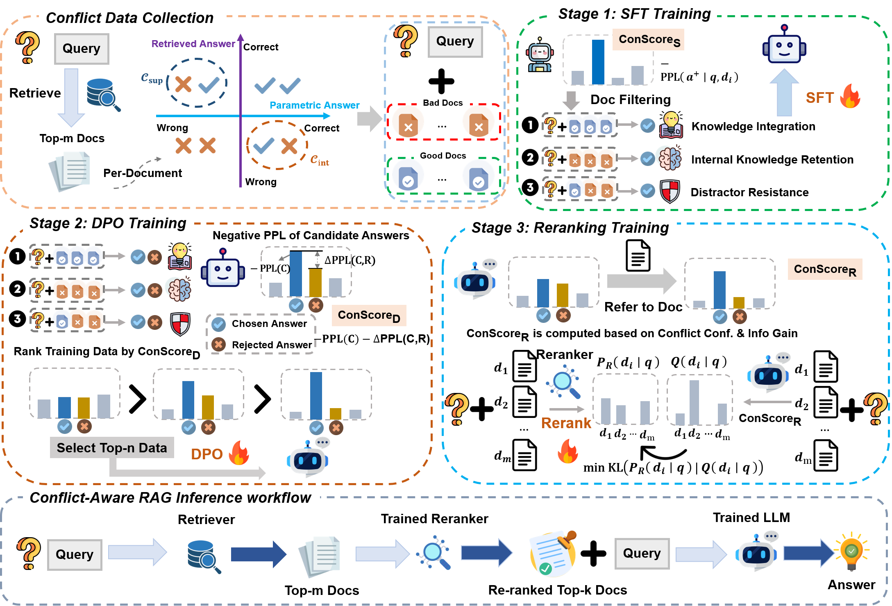

# Conflict-Aware RAG: Multi-Stage Learning with Conflict Signals for Robust Retrieval-Augmented Generation

## Overall Framework

**Conflict-Aware RAG** is a unified framework that leverages **ConScore**—a conflict scoring metric derived from the LLM itself—to guide data selection and training across SFT, DPO, and Reranking stages. By consistently filtering and organizing data with ConScore, the framework integrates model preferences into each stage, strengthening conflict modeling, improving robustness, and achieving better alignment between generation and reranking.

For the LLM training, we use the LLaMA-Factory framework to conduct SFT and DPO.